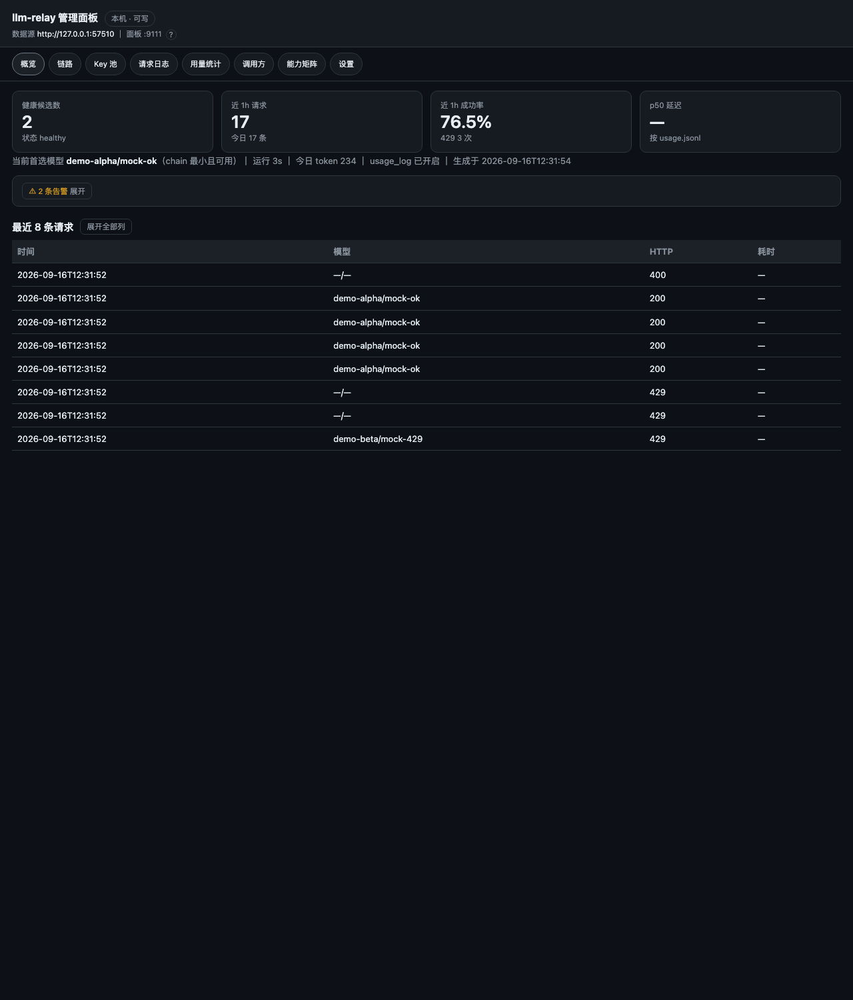
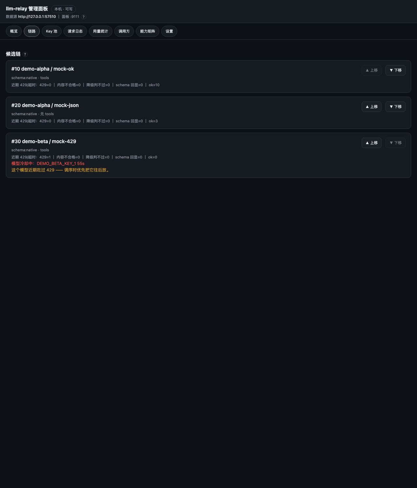
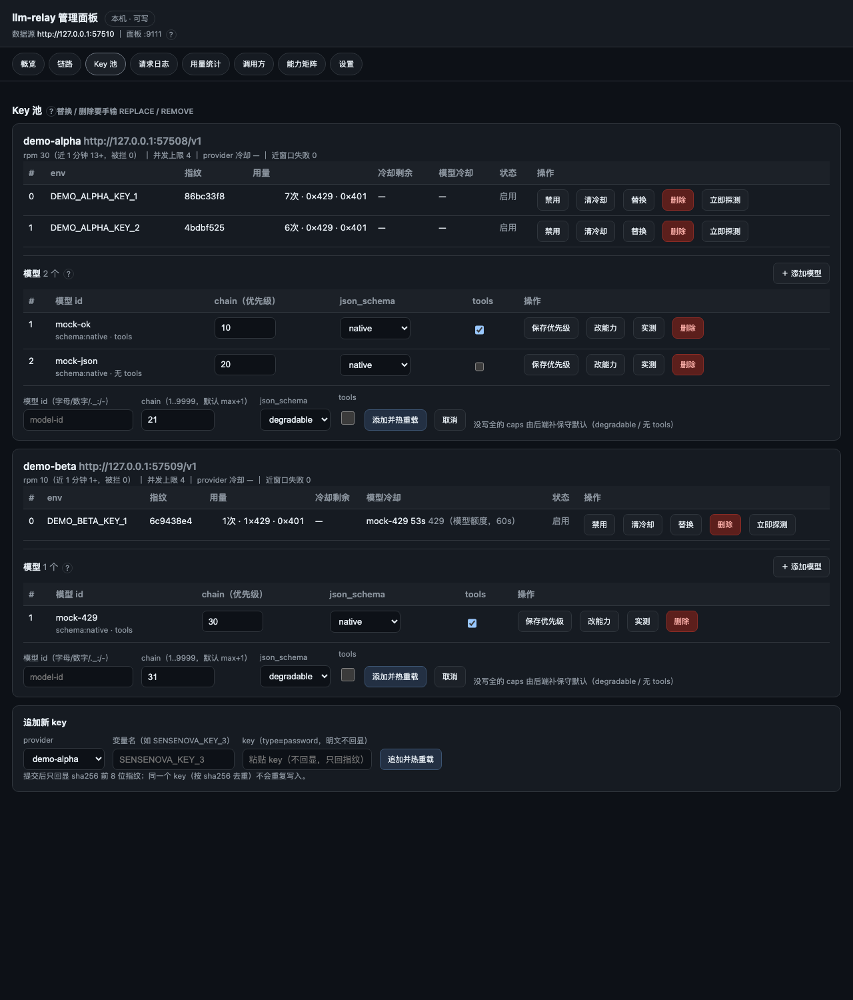
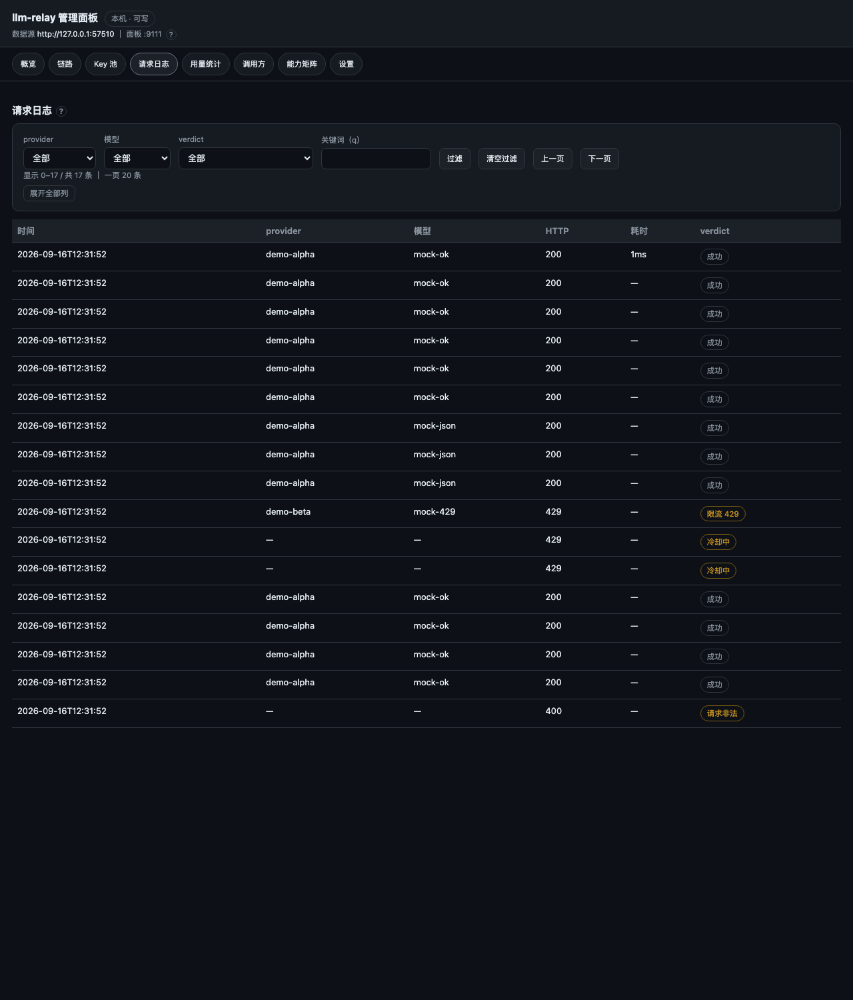
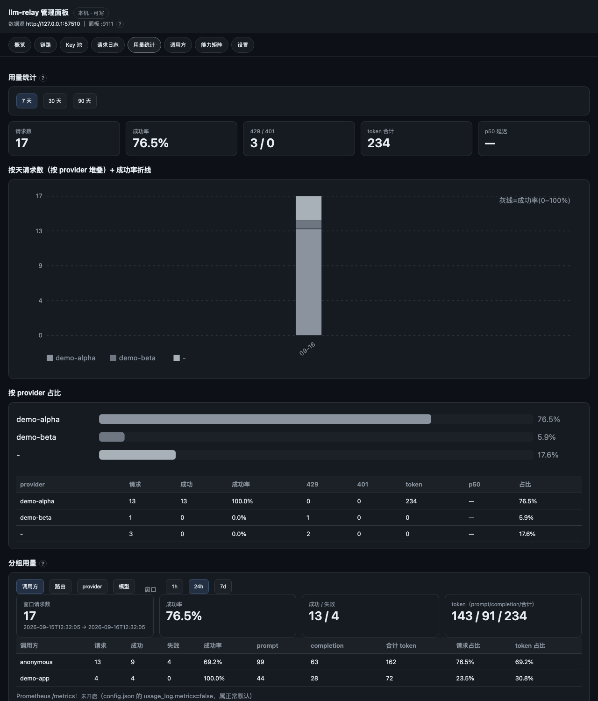
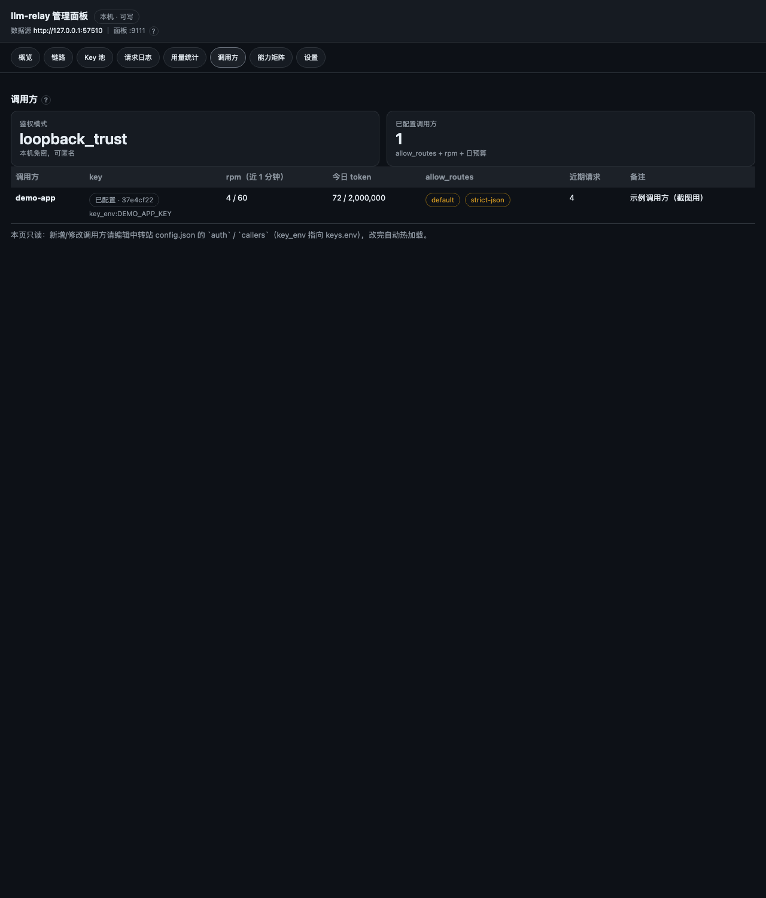
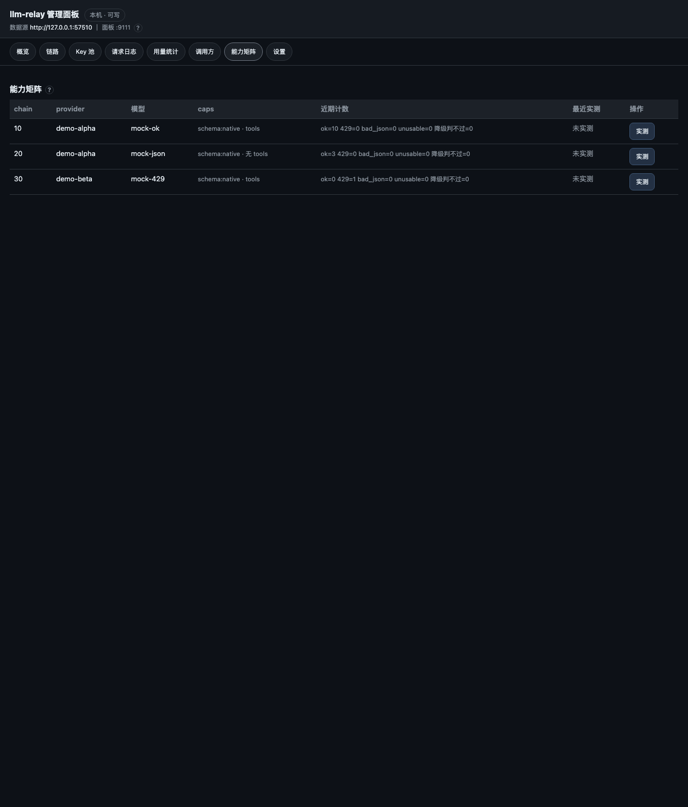
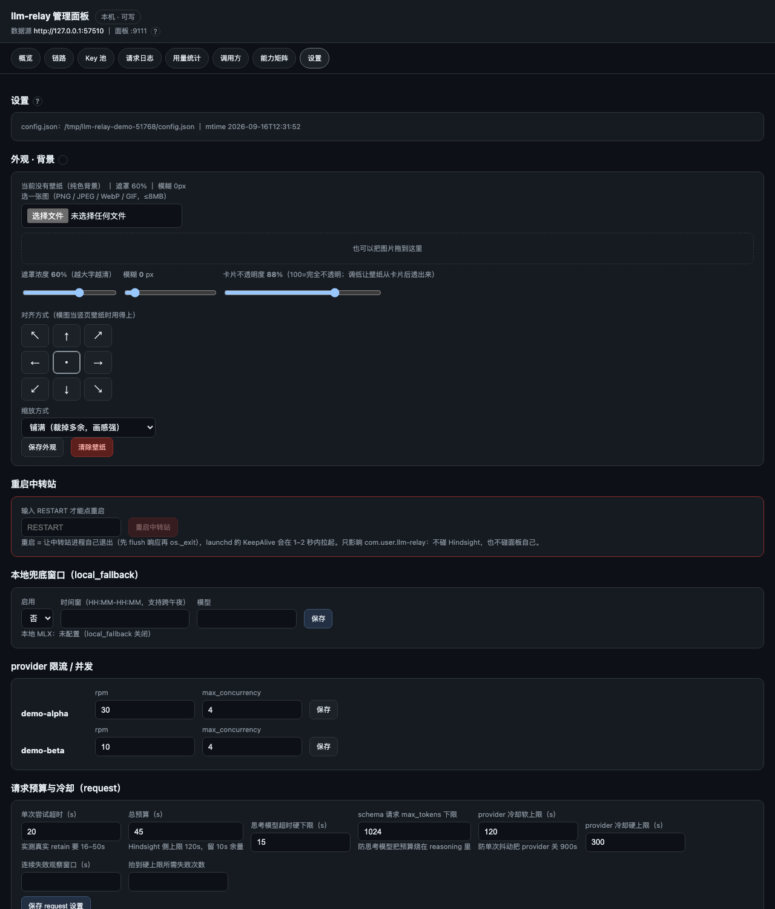

# llm-relay

[English](README.md) ｜ **简体中文**

**一个文件、零依赖，把一堆厂商和它们的免费额度收拢成一条 OpenAI 兼容接口。**

[](https://github.com/GerateGuo/llm-relay/actions/workflows/ci.yml)


`llm-relay` 是**单文件、纯标准库**的 OpenAI 兼容中继：对外只暴露一个
`POST /v1/chat/completions`，对内把「多 provider、每个 provider 多把 key、key 级限流、
冷却与退避、链式兜底、响应形状归一化、`json_schema` 处理」全部吃掉。换 key、换模型
**不用改调用方，也不用重启调用方**。

自带运维面板（候选链、Key 池、请求日志、用量、能力实测、设置），默认按
**长 prompt 结构化抽取**这类负载调优：单次超时、总预算、思考模型的最短超时、schema 请求的
`max_tokens` 下限，全部来自实测而不是拍脑袋的默认值。

```
你的应用 ──► llm-relay:9110 ──► 候选 #1  (厂商 A / 模型 X / key 1)
 (一个地址,      │              候选 #2  (厂商 A / 模型 Y / key 2)
 一个模型名)     │              候选 #3  (厂商 B / 模型 Z / key 1)
                └── 冷却、rpm 令牌桶、重试、schema 校验、用量记账
```

## 为什么再造一个中继？

| | llm-relay | LiteLLM / one-api 一类 |
|---|---|---|
| 体量 | 1 个文件、Python 标准库、`python3 llm_relay.py` | 服务 + 三方依赖 + 数据库 |
| 免费额度治理 | 一等公民：key 级 rpm 令牌桶、key/模型/provider 三级冷却、退避封顶 | 通常只有全局限流 |
| 运维面板 | 内置，零额外依赖 | 另起 UI / 数据库 |
| 结构化抽取 | 严格校验 `json_schema`、拒绝 schema 回显、坏内容直接 502 | 透传 |
| 多租户计费、账号、账单 | **不做 —— 有意为之** | 有 |

需要多租户和成本核算就用那些。这个适合的场景是：想要一个够小、可审计、能把免费 key 压到
极限、并且**绝不把垃圾内容交给你的流水线**的进程。

## 特性

- **链式兜底**：每个模型带一个 `chain` 号。候选按「过滤 → 按 `chain` 升序 → 截断到
  `request.max_candidates`」构建；某候选因可重试的原因失败就自动交给下一个。
- **key 级节流**：每 provider 一个 rpm 令牌桶 + 一个 `max_concurrency` 信号量；
  超限的请求最多等 `request.queue_timeout_s`，等不到就换候选 —— **不会被静默打到上游**。
- **有上限的冷却**：429 认 `Retry-After`/reset 头；401/403 禁用该 key；402 或响应体命中
  「额度耗尽」把该 key 停 1 小时；5xx/超时冻的是 provider —— 单次失败最多
  `provider_cooldown_cap_s`（默认 120s），只有窗口内连败到 `provider_escalate_after_failures`
  次才允许升到 `provider_cooldown_hard_cap_s`（默认 300s）。一次网络抖动不再会让整个 provider 停 15 分钟。
- **key 级隔离**：某个模型额度耗光，冷的是**它那把 key**，不是 provider —— 同一 provider 上
  其它 key 的健康模型照常服务。
- **响应归一化**：`content` 空但 `reasoning`/`reasoning_content` 有值 → 提升为 `content`；
  `usage` 缺失 → 补零；`tool_calls` 原样透传。
- **JSON 是真的对**：调用方给了 `json_schema`，返回体就要**对照 schema** 校验（required、
  类型、enum、`additionalProperties`、嵌套 items）。把 schema 本体回显进 `content`、或回一个
  `properties` 片段的，一律判失败；所有候选都不合格时回 **502 `relay_unusable_content`**，
  而不是一个带垃圾内容的 200。
- **命名路由**：模型名可以映射到自己的链与策略（`max_candidates`、`validate_json`、
  `schema_min_max_tokens`、`free_only`），不必跟着全局行为走。
- **调用方（callers）**：具名身份用环境变量里的 key 认证，各有自己的 `rpm`、`daily_tokens`
  预算与 `allow_routes` 白名单；`auth.mode` 可选 `loopback_trust`（单机默认）或 `require_key`。
- **用量记账**：每次尝试（成功与失败）追加一行 JSON 到 `usage.jsonl`，字段含
  `ts / alias / caller / provider / model / key_index / http / latency_ms / attempts[] / verdict /
  *_tokens`；**只记 key 序号与指纹，永不记明文**。`GET /admin/usage` 可按调用方/路由/provider/模型
  聚合 1 小时、24 小时、7 天；Prometheus `/metrics` 需要显式打开 `usage_log.metrics`。
- **内置面板**（`llm-relay-dashboard.py`，同样零依赖）：候选链、Key 池、模型、请求日志、用量、
  能力实测、调用方、设置、外观。本机免密，其它来源需要访问密钥且**默认只读**。
- **可选集成**：本地模型兜底窗口、`integrations.upstream`（把配套服务挂进面板，用法见
  `examples/hindsight/`）。不配就完全不启用。

## 快速开始

```bash
git clone https://github.com/GerateGuo/llm-relay.git
cd llm-relay

python3 llm_relay.py --init        # 用 config.example.json 生成 config.json（已存在则拒绝覆盖）
$EDITOR config.json                # 填你的上游地址、模型，以及密钥的「环境变量名」
$EDITOR keys.env                   # EXAMPLE_OPENAI_KEY=sk-...   （chmod 600，已在 .gitignore 里）

python3 llm_relay.py --check       # 配置体检 + 打印它会用的候选顺序（不起服务）
python3 llm_relay.py               # 中继起在 127.0.0.1:9110
```

然后像调任何 OpenAI 兼容接口一样调它：

```bash
curl -s http://127.0.0.1:9110/v1/chat/completions \
  -H 'Content-Type: application/json' \
  -d '{"model":"default","messages":[{"role":"user","content":"你好"}]}'
```

`model` 是**路由名**（默认 `default`，可通过 `default_alias` 改），或者精确的
`provider/model`。`GET /v1/models` 会把两者都列出来，并带上各自的 `chain` 与当前可用性。

需要面板时（默认监听 `0.0.0.0`；非本机访问需要访问密钥且只读）：

```bash
python3 llm-relay-dashboard.py                 # http://127.0.0.1:9111
python3 llm-relay-dashboard.py --host 127.0.0.1
```

不需要 pip 安装、不需要数据库、不需要构建。Python 3.9 起。

## 一个请求怎么走

1. **解析模型名**：依次是 `routes` 里的名字 → 精确的 `provider/model` → `model` 缺失时用
   `default_alias` → 都不命中就 **HTTP 400**，并在响应里列出可用名字。
2. **构建候选**：过滤掉 `enabled: false` 的 provider、没有可用 key（未定义/被禁用/冷却中）的
   provider、`disabled` 的模型；路由带 `policy.free_only` 时还会滤掉没显式标 `free: true` 的。
   剩下的按 `chain` 升序排，截断到生效的 `max_candidates`。
3. **按顺序试**，直到总预算 `request.total_budget_s` 用光。每次尝试有
   `request.per_attempt_timeout_s`（声明了 `caps.reasoning_only` 的模型抬高到
   `request.reasoning_min_timeout_s`），每次都记下自己的 verdict。
4. **判断内容能不能用**：调用方要求 JSON 时，既要能 parse，**也要符合 schema**；schema 回显被判失败。
   不合格算一次失败尝试，换下一个候选。
5. **返回**：胜出的上游响应体原样返回（只做上面说的归一化）。全都不合格就回 502，
   带上原因与尝试链 —— **绝不会**给流水线一个带坏内容的 200。

**能力是声明出来的，不靠猜。** 每个模型带 `caps`（`json_schema`: `native` | `degradable` | `none`、
`tools`、`reasoning_only`）和可选 `params`（`strip_temperature`、`max_tokens_multiplier` 等）。
`degradable` 的模型走「把 schema 内嵌进提示词」的降级路径 —— 但**校验一视同仁**：降级只改变
「怎么向上游要 JSON」，不改变「期望什么形状」。

## 配置

`config.json` 由 `--init` 生成，**不入库**（入库的只有模板 `config.example.json`），保存即热重载
（不用重启）。顶层字段：

| 字段 | 作用 |
|---|---|
| `listen` | `{host, port}`，默认 `127.0.0.1:9110` |
| `default_alias` | 请求没给 `model` 时用的路由名（默认 `default`） |
| `local_token` | 旧的运维令牌；配了它以后 `/admin/*` 还需要 `Authorization: Bearer <token>` |
| `auth` | `{mode: "loopback_trust" \| "require_key"}`：谁必须出示调用方 key |
| `callers` | 具名身份：`key_env`（或内联 `key`，别把内联 key 提交上去）、`rpm`、`daily_tokens`、`allow_routes`、`note` |
| `request` | 超时、预算、候选数、JSON 校验、冷却封顶 |
| `concurrency` | `{global: N}`：进程级在飞请求上限 |
| `usage_log` | `{enabled, path, max_mb, keep, metrics}`：每次尝试一行 JSON，按大小轮转 |
| `key_state` | 面板写入的 key 启用/禁用与冷却持久化位置 |
| `providers` | provider 列表（见下） |
| `routes` | 命名路由，各自带链与策略 |
| `local_fallback` | 可选的本地模型兜底，可限定时间窗（如 `01:00-07:00`） |
| `integrations` | 可选的配套服务集成（面板里多一个 tab） |

一个 provider：

```jsonc
{
  "name": "example-openai",
  "enabled": true,
  "base_url": "https://api.example.com/v1",
  "wire": { "max_tokens_param": "max_tokens", "extra_headers": {} },
  "keys": ["EXAMPLE_OPENAI_KEY"],          // 环境变量名，值放 keys.env
  "rpm": 10,                               // 本地令牌桶，按你的免费档实测校准
  "max_concurrency": 2,
  "key_cooldown_s": 120,
  "provider_cooldown_s": 180,
  "cooldown_backoff": { "initial_s": 60, "max_s": 900, "factor": 2 },
  "free": false,                           // 免费档要**显式**标，中继绝不替谁猜
  "models": [
    { "id": "example-chat", "chain": 10,
      "caps": { "json_schema": "native", "tools": true, "reasoning_only": false }, "params": {} }
  ]
}
```

完整字段表在 [`docs/providers.md`](docs/providers.md)；可直接跑的两 provider 示例（一个 HTTP 上游
+ 一个本地假源）在 [`config.example.json`](config.example.json)。

路由与调用方：

```jsonc
"routes": {
  "default":     { "chain": "auto", "policy": {} },
  "cheap":       { "chain": "auto", "policy": { "free_only": true, "max_candidates": 2 } },
  "strict-json": { "chain": ["example-openai/example-chat", "local-mock/mock-json"],
                   "policy": { "validate_json": true, "schema_min_max_tokens": 1024 } }
},
"callers": {
  "my-app": { "key_env": "RELAY_CALLER_MY_APP", "rpm": 60, "daily_tokens": 2000000,
              "allow_routes": ["default", "strict-json"] }
}
```

两个程序用到的环境变量：

| 变量 | 默认 | 含义 |
|---|---|---|
| `LLM_RELAY_BASE` | `http://127.0.0.1:9110` | 面板要连的中继地址 |
| `LLM_RELAY_KEY_FILE` | `<脚本所在目录>/access-key.txt` | 面板访问密钥文件（首次启动自动生成） |
| `HS_DASH_CONFIG_JSON`、`HINDSIGHT_CP_KEY_FILE`、`HINDSIGHT_CP_ACCESS_KEY`、`HINDSIGHT_DASH_BASE`、`HINDSIGHT_CP_BASE` | — | 仅用于可选的配套服务集成 |

两个程序都会**绕过系统代理**访问回环地址 —— 否则系统级代理（ClashX、Charles 之类）会把
`127.0.0.1` 的请求接管成 502（本项目反复踩过）。

## 命令行

```bash
python3 llm_relay.py [--config config.json] [--keys keys.env] [--host H] [--port P] [--check] [--init]
python3 llm-relay-dashboard.py [--host H] [--port P] [--key-file F] [--relay URL] [--allow-remote-write]
python3 mock_provider.py [--host H] [--port P] [--scenario normal|rate_limit|timeout|empty_content|schema_echo|slow] [--hang-s S]
python3 -m unittest test_relay                     # 测试套件（不联网、无依赖）
python3 scripts/sanitize_check.py                  # 个人路径 / 明文密钥守卫（CI 也用它）
```

`--check` 只做配置体检并打印它将使用的候选顺序，不起服务；写坏的字段会以「字段路径 + 期望 +
实际」的可读形式报出，并**禁用出错的 provider 而不是拒绝启动**。

## HTTP 接口

| 方法 | 路径 | 说明 |
|---|---|---|
| POST | `/v1/chat/completions` | OpenAI 兼容；支持流式 |
| GET | `/v1/models` | 别名 + `provider/model` 条目，带 `chain` / `available` |
| GET | `/health` | `{"status": "healthy"\|"degraded", "candidates_healthy": N}`；没有可用候选时 503 |
| GET | `/` | 极简深色状态表（与 `/status` 同源） |
| GET | `/status` | 计数、各 provider/key/模型状态、最近 20 条请求、当前生效的 request 参数 |
| GET | `/admin/config` | 磁盘上的配置 + mtime；key 只给变量名 + 指纹 |
| POST | `/admin/config` | `{"patch": {...}}`：读磁盘最新 → 只应用指定键 → 备份 → 原子写回 → 热重载 |
| POST | `/admin/reorder` | `{"order": ["provider/model", ...]}`：把 `chain` 重写成 1..N |
| POST | `/admin/model` | `{"action": "add"\|"update"\|"remove", ...}`：只动 `providers[].models` |
| POST | `/admin/key` | `{"provider", "env_name", "secret"}`：只回指纹，绝不回值 |
| POST | `/admin/key/state` | 启用/禁用 key，或清冷却 |
| POST | `/admin/key/replace` | 原地换 key 值；sha256 去重；其它行逐字节不变 |
| POST | `/admin/key/remove` | `{"provider", "env_name", "confirm": "REMOVE"}` |
| POST | `/admin/probe` | `{"provider", "model"}`：chat + 严格 `json_schema` + tools 三条真实请求 |
| POST | `/admin/reload` | 强制重载配置/密钥（等价 SIGHUP） |
| POST | `/admin/restart` | `{"confirm": "RESTART"}`：先回包再自退，交给守护进程拉起 |
| GET | `/admin/requests` | `usage.jsonl` 明细：`?limit=&offset=&provider=&model=&verdict=&since=&probe=1` |
| GET | `/admin/usage` | `?group=caller\|route\|provider\|model&window=1h\|24h\|7d`，或 `?days=7\|30\|90` 看按天视图 |
| GET | `/admin/callers` | 调用方视图：是否配置、指纹、近 1 分钟 rpm、今日 token 与上限、允许的路由 |
| GET | `/admin/upstream` | 配套服务健康 + 启动脚本状态；未配置时 `{"configured": false}` |
| POST | `/admin/upstream/rollback` | `{"confirm": "ROLLBACK"}` |
| GET | `/metrics` | Prometheus 文本格式；只有 `usage_log.metrics` 为真时才开（否则 404） |

所有 `/admin/*` 都要求来源是本机回环（否则 403）；配了 `local_token` 时还要带上对应的 Bearer。
面板与内部能力实测走 `probe` 别名，**不参与路由解析、不吃调用方配额**。

## 面板

`llm-relay-dashboard.py` 渲染一个自包含的单页（无 CDN、无框架、不发起外部请求）：

- **九个 tab**：概览 / 链路 / Key 池 / 请求日志 / 用量统计 / 调用方 / 能力矩阵 / 设置
  （外观·背景图在「设置」里）；只有在 `integrations.upstream` 配置后才会多出「上游」tab。
  数据都经回环从运行中的中继实时读。
- **密钥门**：本机免密；局域网/手机访问要带 `?k=<密钥>`，之后用 30 天 cookie 记住。
  密钥文件首次启动自动生成，权限 600。
- **远程只读**：所有写路径（改配置、管 key、重启）在非回环来源一律拒绝，除非显式加
  `--allow-remote-write`。写入的安全姿势是：从磁盘读最新配置 → 只 patch 你改的键 →
  留时间戳备份 → 原子写回 → 热重载。
- **能力实测**：对每个模型真发三条请求（普通 chat、严格 schema、tools），让你看到模型**实际**
  能做什么，而不是靠名字猜。

只想要一个轻量状态页、不想要面板，中继自己在 `/` 提供的那个就够。

## 截图

`docs/` 下的图全部由 [`dev/make_demo_shots.py`](dev/make_demo_shots.py) 用**合成数据**生成：
进程内起两个假上游（一个正常、一个专回 429）+ 一次性端口上的中继 + 临时面板，配置里的
provider 就叫 `demo-alpha` / `demo-beta`。**不涉及任何真实厂商、密钥或部署**。

| 概览 | 链路 |
|---|---|
|  |  |
| **Key 池** | **请求日志** |
|  |  |
| **用量统计** | **调用方** |
|  |  |
| **能力矩阵** | **设置** |
|  |  |

窄屏那张（`docs/dashboard-overview-narrow-480.png`）来自 480px 的无头 Chrome 窗口；Chrome 的
CSS 视口有 ~500px 下限，所以它验证的是 `max-width: 560px` 那套响应式布局（表格转卡片）。

重出：`python3 dev/make_demo_shots.py`（需要无头 Chrome；macOS 用默认路径，其它平台设
`CHROME=/path/to/chrome`）。

## 测试

```bash
python3 -m unittest test_relay            # 106 项，不联网、无依赖
python3 dev/dashboard_smoke_test.py       # 面板自检（需要起着的服务 + 无头 Chrome）
```

`test_relay.py` 在进程内起自带假上游，覆盖路由、冷却、预算、rpm 记账、schema 校验
（含 schema 回显与片段回显两种坑）、key 管理与 `config.json` 的红线。它在 CI 的
3.9 / 3.11 / 3.13 三档上原样跑通。

`dev/dashboard_smoke_test.py` 是本机自检工具、不进 CI：它通过 CDP 驱动真实浏览器点击面板。
注意**它的退出码不是结论** —— 要看打印出来的 `OK` / `FAILED`。

## 假上游

`mock_provider.py` 是测试、演示截图和手工调试用的假 provider。行为由请求里的**模型名**决定
（`mock-json`、`mock-429`、`mock-cot` …），另有 `--scenario` 可注入限流、挂起、空响应体、
schema 回显、慢响应。它同时认多种厂商路径形状（`/v1/...`、`/openai/v1/...`、`/proxy/llm/...`），
所以不用一把真 key、不烧一点额度就能把路由逻辑跑一遍。

```bash
python3 mock_provider.py --port 9199 --scenario rate_limit      # 然后把某个 provider 指过去
```

## 示例

- [`examples/launchd/`](examples/launchd/) —— macOS 上用 launchd 常驻中继（和面板）的模板。
  替换占位符、装到 `~/Library/LaunchAgents/` 即可。
- [`examples/hindsight/`](examples/hindsight/) —— 把中继放在一个 agent 记忆服务前面：
  `integrations.upstream` 片段、它对应的面板 tab，以及回滚脚本。可选，核心不依赖它。

## 调参说明

下面这些都在 `request` 段里，全部来自**真实长 prompt 抽取负载的实测**（约 7KB 系统提示词、
严格 schema、思考模型），不是理论推导：

| 参数 | 默认 | 为什么 |
|---|---|---|
| `per_attempt_timeout_s` | 60 | 思考模型上一次真抽取要 16–50s；25s 和 45s 实测都会打满超时 |
| `reasoning_min_timeout_s` | 45 | 会先思考再回答的模型的最短超时 |
| `total_budget_s` | 110 | 必须**小于调用方自己的请求超时**（参考调用方用 120s） |
| `max_candidates` | 3 | 够扛两把坏 key，又不会撑爆预算 |
| `schema_min_max_tokens` | 1024 | 再低，思考模型会把预算烧在 reasoning 上，然后把 schema 回显给你 |
| `provider_cooldown_cap_s` / `_hard_cap_s` | 120 / 300 | 一次超时不该让一个 provider 消失 15 分钟 |
| `provider_escalate_after_failures` | 3 | 只有反复失败才允许升到硬封顶 |

## 安全

默认只听回环、密钥只从环境变量或本地文件读、日志与接口响应不含明文 key、面板远程只读。
完整威胁模型（含什么时候该把 `auth.mode` 切到 `require_key`）见 [`SECURITY.md`](SECURITY.md)。
漏洞请走 GitHub 的 Private vulnerability reporting，不要开公开 issue。

## 参与贡献

见 [`CONTRIBUTING.md`](CONTRIBUTING.md)。一句话：只用标准库，测试全绿（`python3 -m unittest test_relay`，
项数只增不减），`config.json` / `keys.env` / `access-key.txt` 永不提交。
